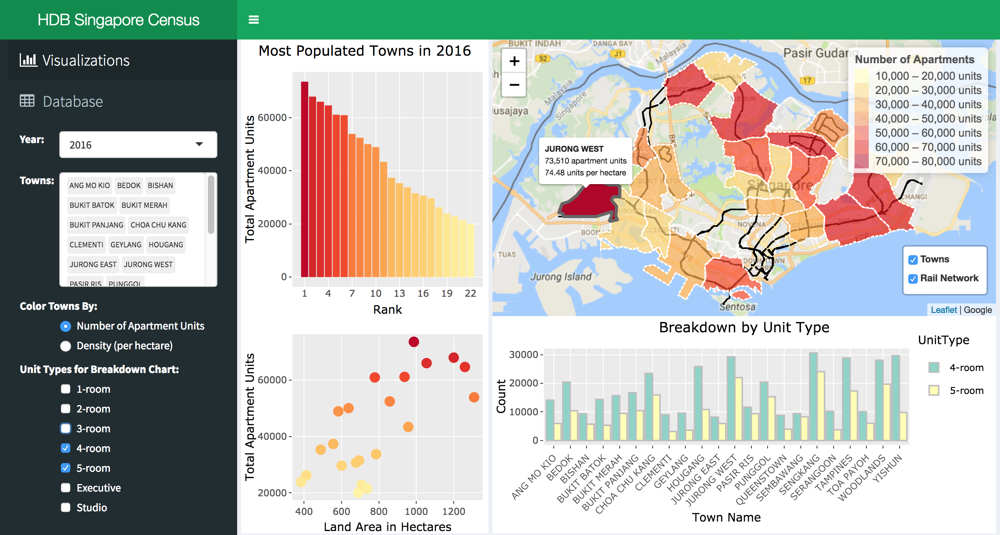

# Project 2: Singapore Housing Visualization

## Which towns are the most densely populated?

By: Min Yan BEH (mbeh)

Project 2 has been deployed on https://mbeh.shinyapps.io/project2/

*Note: Pls wait 3-5 seconds for charts anad maps to load.*

### Dataset Source

All data was taken from the public API provided by the Singapore government on https://data.gov.sg. This site is the centralized source of information on government ministries, census information and data concerning the Singapore society in general.

Most of the data used in this project was provided by the Housing & Development Board (HDB), which is the statutory board of the Ministry of National Development responsible for public housing in Singapore.

Links to data sources:

* KML data on Singapore towns - [data.gov.sg](https://data.gov.sg/dataset/planning-area-census2010)
* KML data on railway network - [data.gov.sg](https://data.gov.sg/dataset/mp08-rail-line?resource_id=98686bee-5440-4758-8adf-676d6085a736)
* Data on HDB unit types by town - [data.gov.sg](https://data.gov.sg/dataset/number-of-residential-units-under-hdb-s-management?resource_id=34b7e3fe-b3b9-4f08-a5ca-c8574f13ccbd)
* Data on land area by town - [data.gov.sg](https://data.gov.sg/dataset/land-area-and-dwelling-units-by-town?resource_id=898d985a-0996-4efd-b2c2-7d9fab4138e9)

### Context

Background:

* I grew up in Jurong West, the most populated town in Singapore in terms of number of apartment units. 
* This is significant as 80% of all Singaporeans live in these HDB (government-built) units ([Economist.com](https://www.economist.com/asia/2017/07/06/why-80-of-singaporeans-live-in-government-built-flats)). Growing up, I absolutely hated going to the crowded malls in the weekends.
* Very recently, my parents decided to move to Tampines Town (of ALL places), which happens to be the second most populated town.

As I might be living with my parents for a few more years, I’m creating this visualization mostly for my parents, hopefully to convince them to change their mind. Otherwise, I might just start accepting reality and comfort myself with the fact that the densest town is Choa Chua Kang, at the whopping 84 units per hectare, which I recently learnt from doing this project.